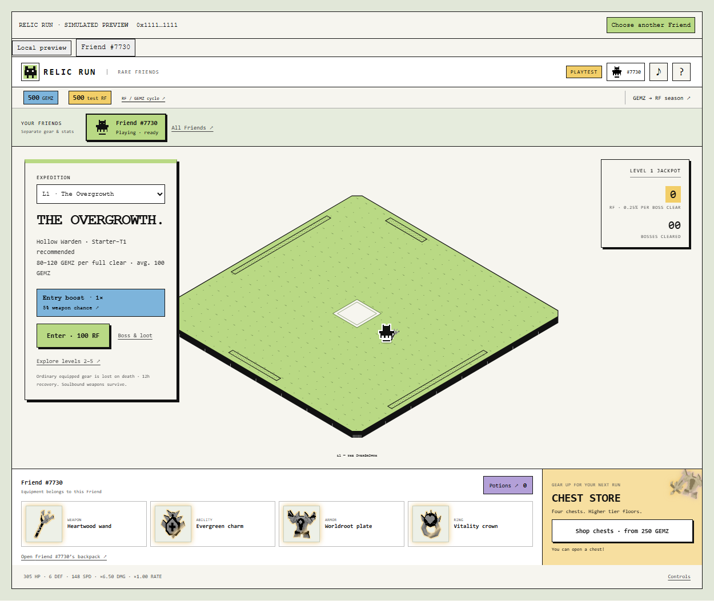

# Relic Run

A Rare Friends action roguelite: play as your owned Friend through five short
expeditions, collect gear and contribute internal GEMZ to daily simulated RF seasons.

**[Play the public preview](https://baiqnbaiqn.github.io/relic-run/)** ·
**[Rules, costs and full reward odds](submissions/relic-run/README.md)**

Built by **Justin Walker / [@BaiqnBaiqn](https://github.com/BaiqnBaiqn)** for the
Rare Friends vibeathon, Economy Potential category.


*Automated test-wallet fixture, showing the actual SDK host and sandbox game.*

## Play

The public demo requires a browser wallet holding a hardwired Rare Friends
Generations NFT (generation 1+) on Robinhood mainnet, chain **4663**. Connect,
choose your Friend and enter an expedition. The selected NFT's canonical image
is your avatar. No RF funding, signature, token approval or transaction is needed.
All balances, rewards, purchases, jackpots and recovery timers are simulated.

Move with WASD/arrows, click-to-move or the touch joystick. Attacks are automatic.
Q uses your equipped ability; Space/Shift dodges. Escape or focus loss pauses.
Clear three minion waves, then the boss and its two half-health guards. Spend
GEMZ on gear chests or commit it to the 24-hour RF season, ending at midnight UTC.

There are 75 ordinary chest items across T1–T5 and four equipment slots, five
boss soulbound weapon collections, five jackpot exclusives and L5 Fortune's Fang.
Higher levels add tide attacks, crystal beams, heat hazards and combined patterns.
Generation defeat loses ordinary equipped gear, resets consumed potion bonuses
and imposes 12-hour recovery. Soulbound weapons, backpack items and stored potions
survive. Leaving an unfinished run counts as defeat.

## Install and run

Node.js **22.18+** (Node 24 recommended), npm and a current browser are required.

```sh
git clone https://github.com/BaiqnBaiqn/relic-run.git
cd relic-run
npm ci
npm run dev
```

Local development opens at `http://localhost:4173/?mode=guest`; no wallet is
needed for this explicitly separate playtest. Local wallet mode is
`http://localhost:4173/wallet/index.html` and also supports Genesis rules.
`npm run dev:wallet` uses port 4174. Guest progress stays separate from the
public sandbox's saves. The development server binds to 0.0.0.0 for LAN testing.

For the actual ownership-gated submission build:

```sh
npm run build:submission
```

Serve **all seven files** from `games/relic-run/.preview/` on HTTPS, preserving
relative paths and HTML CSP. The public build has no guest route or query bypass.
The GitHub Pages workflow validates and publishes this directory on main updates.
Do not publish `.guest/` as the submission preview.

## SDK and persistence

Uses React 19.2.8, TypeScript 6.0.3, Canvas 2D, esbuild, viem 2.56.3 and
**FriendSDK 0.1.4**, vendored from upstream tag commit
`ca3bf183b809ecf22d87c63d88ce03969a3f8da2` for reproducible installs.

`wallet.tsx` owns connection/selection through SDK helpers. `sandbox-host.tsx`
mounts **ConnectedGameHost**, which freshly verifies the selected Friend and
runs **GameSession** from `sandbox-child.tsx` in an opaque-origin iframe with
`sandbox="allow-scripts"`. Game code has no parent DOM, wallet-provider or browser
storage access. The selected canonical artwork is read using the SDK sprite API.

Our narrow MessagePort extension carries simulated saves to the host, which
checks the frame/session, selected Friend, schema and conservation before
persisting and acknowledging. A Web Lock permits one writer across tabs. Failed
saves pause with retry; unfinished entries recover as defeat. Inventory, equipped
items, potions and cooldowns are keyed by the verified **canonical NFT wallet**.
Reconnect and select the same Friend to restore them on this site and browser.
Saves are not cloud-synced or on-chain items. Changing devices or clearing browser
data does not preserve them; signing-owner changes do not change the NFT-wallet key.

The runtime requires a chance-game definition: `game.json` contains explicitly
unused reference metadata. This game never calls those chance actions. The real
custom economy is described in `economy.json` and implemented in `economy.ts`.
Use our custom build command above, not the generic SDK CLI hosting build, to
include both the sandbox and persistent-save host.

## Economy

Entry RF / mean clear GEMZ: **100/100, 200/230, 400/520, 800/1160, 1600/2560**.
Clear GEMZ varies ±20%. Entry multiples scale GEMZ exactly; weapon odds follow
a concave curve (20× at 50× entry). All costs and odds appear before entry/buying.

Entries fund **80% global daily RF season / 15% level jackpot / 5% ecosystem**.
Each daily season pays its whole funded pool pro rata by GEMZ contributed; those
GEMZ are consumed once. Empty seasons carry RF; each level's jackpot carries
independently. Only a boss clear rolls the **0.25% jackpot**, paying 80% of its
pot plus an exclusive soulbound weapon. 95% is allocated funding, not a guaranteed
personal return. Pools are shared only between Friends in this browser simulation.

Chests cost **250 / 2500 / 25000 / 250000 GEMZ** with successively higher tier
floors. T5 expected acquisition cost is 10,000× a base-chest T1. Purchases save
one outcome before a staged 5.6-second opening/manual reveal, with skip and
reduced-motion support. GEMZ is internal game currency, not a token; no staking.
See [full odds](submissions/relic-run/README.md) and [accounting](games/relic-run/ECONOMY.md).

## Verify

```sh
npm run typecheck
npm run check
npm run check:sdk
npm test
npx playwright install chromium
npm run test:submission
npm run test:sandbox
npm run test:wallet
npm run test:guest
npm run check:contracts
```

80 unit tests cover economy conservation, five fights, odds, gear effects,
24-hour seasons, potion limits and save/death rules. Browser checks use isolated
SDK wallet/RPC fixtures, with no real signing or transactions. They verify the
actual SDK sandbox, a full boss fight, chest purchases, failed-save recovery,
reconnect/reload, ownership failures, canonical avatars and desktop/mobile UI.
The public bundle contains no fixtures. Screenshots are written to `artifacts/`.

`check:contracts` performs only public RPC reads of the Robinhood chain, NFT/RF
bytecode, ownership/canonical wallet and original artwork. Dated JSON is written
to `artifacts/contract-checks.json`. A human-wallet playthrough is not yet verified.

**No Relic Run economy contracts are deployed.** This is a working simulated
submission preview, not live RF settlement. Client combat, time and randomness
are editable; real rewards require an authoritative backend, authenticated
storage and separately reviewed RF contracts. Official Rare Friends production
publication is separate from this public preview/submission.

## Art and credits

Original low-poly Blender models and sprites: `games/relic-run/art/models/lowpoly/`.
All 75 items have iterative silhouettes, two black/white materials and 52–292
triangles. `npm run art:models` rebuilds models/renders with Blender installed;
set `BLENDER_BIN` if it cannot be found. Generated game icons are checked in,
so Blender is not required to run or build the game. Models supplied by the
builder and older pixel studies are retained separately as reference assets.

FriendSDK provides canonical NFT artwork, palette/world references and synthesized
sound APIs. Equipment geometry and combat effects are original. RuneScape and
Realm of the Mad God were visual/mechanical references, not copied asset sources.
[Full asset notice](games/relic-run/art/NOTICE.md) ·
[FriendSDK](https://github.com/spokesz/friendsdk) ·
[Vendored SDK license/notice](vendor/README.md).
